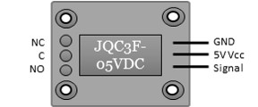
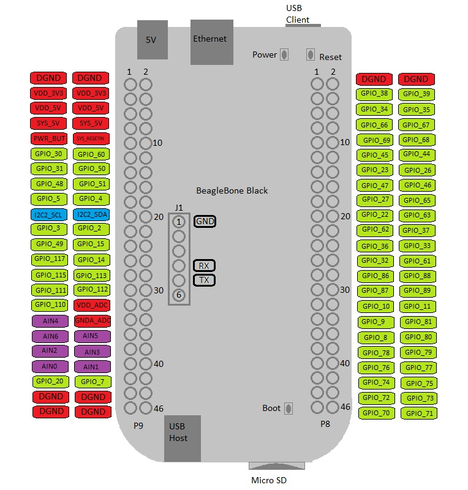
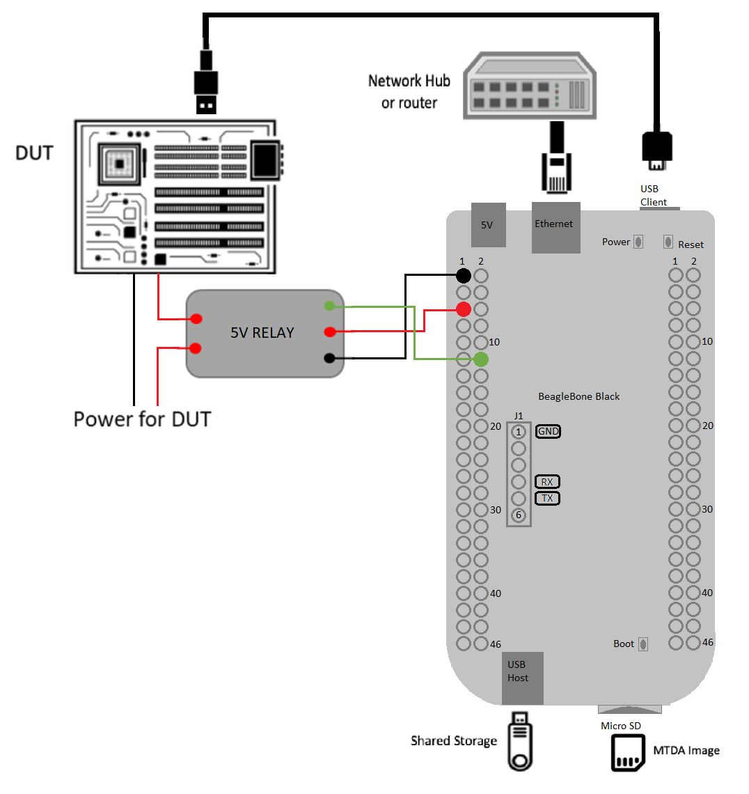
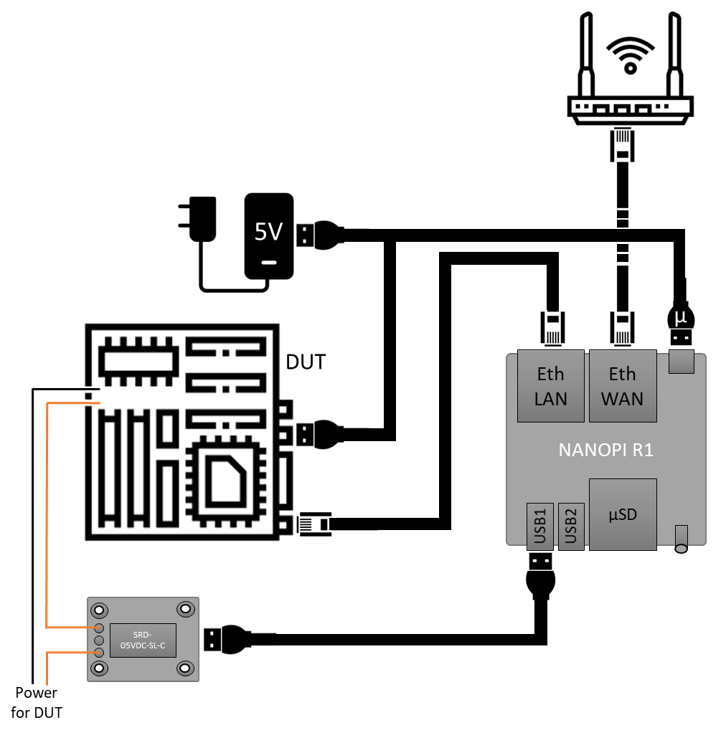
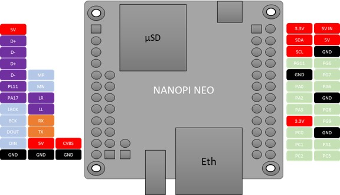
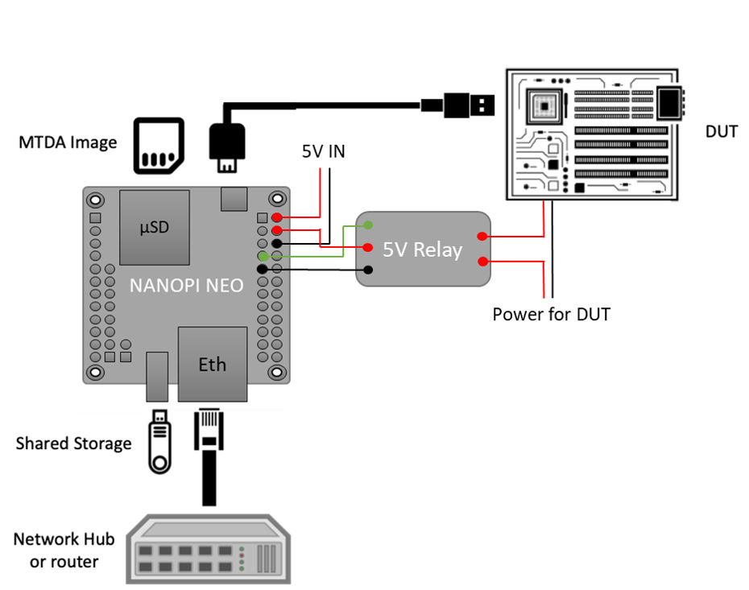
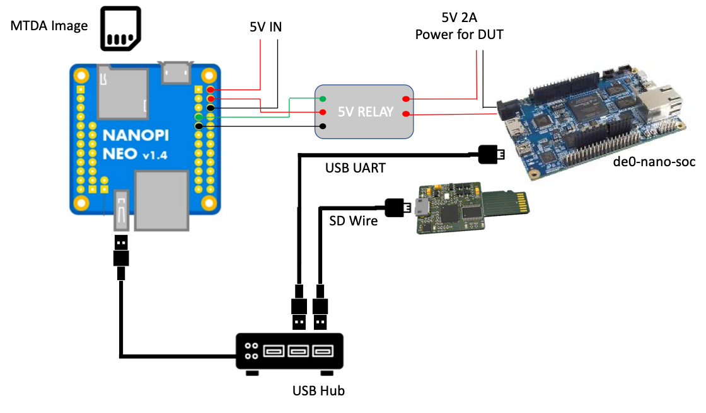

Build Your Own
==============

This chapter describes how you may build your own device to run the agent side
of MTDA. Most of the configurations presented here are basic and may be enhanced
with additional electronic gadgets.

KVM
---

If you do not have a Single Board Computer (SBC) such as the NanoPI NEO-LTS, you
may start with KVM. Instead of controlling a physical device, MTDA will spawn a
virtual machine. It will provide a virtual hard disk for the operating system,
a virtual USB drive to install the system from and a virtual serial port to
interact.

Installing KVM on Debian
~~~~~~~~~~~~~~~~~~~~~~~~

The following packages should be installed on Debian (or derivatives of Debian
such as Ubuntu)::

    $ sudo apt install qemu-kvm

The user running the MTDA agent should be added to the ``kvm`` group::

    $ sudo addgroup $USER kvm

Logout or reboot your PC for the group changes to take effect.

Configuring MTDA
~~~~~~~~~~~~~~~~

A sample configuration is shipped with the code and may be copied to your
system::

    $ sudo install -m 0755 -d /etc/mtda
    $ sudo install -m 0644 configs/qemu.ini /etc/mtda/config

Alternatively, get prebuilt packages for Debian as follows::

    $ echo 'deb [trusted=yes] https://apt.fury.io/mtda/ /' | \
      sudo tee /etc/apt/sources.list.d/mtda.list
    $ sudo apt-get update
    $ sudo apt-get install mtda-kvm swtpm

Running the agent
~~~~~~~~~~~~~~~~~

The agent may be manually started after installing required packages and
configuration files as follows::

    $ sudo mtda-service -n

If prebuilt packages were installed (see above), it may be started as a
systemd service instead::

    $ sudo systemctl start mtda

The agent will create three disk image files on startup if they do not exist
(you may create these files yourself with different sizes):

 * ssd.img: 16 GiB serving as primary storage
 * usb-shared-storage.img: 8 GiB as a mass storage that be swapped between host & target
 * usb-data-storage.img: an extra mass storage device

The shared storage (``usb-sdmux``) may be initialized as follows::

    $ mtda-cli target off
    $ mtda-cli storage host
    $ mtda-cli storage write my-os-installer.img

You may then instruct MTDA to boot from the shared storage drive::

    $ mtda-cli storage target
    $ mtda-cli setenv boot-from-usb 1
    $ mtda-cli target on

You may use VNC to access the emulated display (port 5900, no password).

TPM emulation
~~~~~~~~~~~~~

QEMU may emulate a TPM. The following steps were required for Debian-based
hosts. These steps may be skipped if prebuilt packages were installed.

Add missing tpmtool in gnutls-bin
^^^^^^^^^^^^^^^^^^^^^^^^^^^^^^^^^

Make sure your ``/etc/apt/sources.list`` files includes ``deb-src`` entries (you
may need to uncomment entries created by the Debian/Ubuntu installer) and run
``apt update`` to fetch the ``deb-src`` package feeds.

You will then need to pull sources of the gnutls-bin package::

    $ apt-get source gnutls-bin

Amend ``debian/control`` from the gnutls sources to add ``libtspi-dev`` to
``Build-Depends`` like so::

    Source: gnutls28
    Section: libs
    Priority: optional
    Maintainer: Ubuntu Developers <ubuntu-devel-discuss@lists.ubuntu.com>
    XSBC-Original-Maintainer: Debian GnuTLS Maintainers <pkg-gnutls-maint@lists.alioth.debian.org>
    Uploaders:
     Andreas Metzler <ametzler@debian.org>,
     Eric Dorland <eric@debian.org>,
     ...
    Build-Depends:
     ...
     libssl-dev <!nocheck>,
     libtasn1-6-dev (>= 4.9),
     libtspi-dev,
     libunbound-dev (>= 1.5.10-1),
     libunistring-dev (>= 0.9.7),
     net-tools [!kfreebsd-i386 !kfreebsd-amd64] <!nocheck>,
     ...

and replace ``--without-tpm`` with ``--with-tpm`` in ``debian/rules``::

    ...
    CONFIGUREARGS = \
            --enable-ld-version-script --enable-cxx \
            --disable-rpath \
            --enable-libdane --with-tpm \
            --enable-openssl-compatibility \
            --disable-silent-rules \
            ...

You will then need to install the build dependencies::

    $ sudo mk-build-deps -i -r

and build the modified package::

    $ dpkg-buildpackage -b -uc -us

You may now check if the ``gnutls-bin`` package includes ``tpmtool``::

    $ dpkg-deb -c gnutls-bin_*_amd64.deb |grep tpmtool
    -rwxr-xr-x root/root    178040 2020-06-15 17:10 ./usr/bin/tpmtool
    -rw-r--r-- root/root      2322 2020-06-15 17:10 ./usr/share/man/man1/tpmtool.1.gz

and install the updated packages::

    $ sudo dpkg -i gnutls-bin_*_amd64.deb libgnutls-dane0_*_amd64.deb libgnutls30_*_amd64.deb
    (Reading database ... 81477 files and directories currently installed.)
    Preparing to unpack gnutls-bin_3.6.13-2ubuntu1.2_amd64.deb ...
    Unpacking gnutls-bin (3.6.13-2ubuntu1.2) over (3.6.13-2ubuntu1.2) ...
    Preparing to unpack libgnutls-dane0_3.6.13-2ubuntu1.2_amd64.deb ...
    Unpacking libgnutls-dane0:amd64 (3.6.13-2ubuntu1.2) over (3.6.13-2ubuntu1.2) ...
    Preparing to unpack libgnutls30_3.6.13-2ubuntu1.2_amd64.deb ...
    Unpacking libgnutls30:amd64 (3.6.13-2ubuntu1.2) over (3.6.13-2ubuntu1) ...
    Setting up libgnutls30:amd64 (3.6.13-2ubuntu1.2) ...
    Setting up libgnutls-dane0:amd64 (3.6.13-2ubuntu1.2) ...
    Setting up gnutls-bin (3.6.13-2ubuntu1.2) ...
    Processing triggers for man-db (2.9.1-1) ...
    Processing triggers for libc-bin (2.31-0ubuntu9) ...

Get and build libtpms
^^^^^^^^^^^^^^^^^^^^^

Fetch the latest release from GitHub::

    $ git clone https://github.com/stefanberger/libtpms.git
    $ cd libtpms
    $ git checkout v0.9.1

and build it as follows::

    $ sudo mk-build-deps -i -r
    $ dpkg-buildpackage -b -uc -us

and install it::

    $ cd ..
    $ sudo dpkg -i libtpms-dev_*_amd64.deb libtpms0_*_amd64.deb

Get and build swtpm
^^^^^^^^^^^^^^^^^^^

Fetch the latest release from GitHub::

    $ git clone https://github.com/stefanberger/swtpm.git
    $ cd swtpm
    $ git checkout v0.7.0

and build it as follows::

    $ sudo mk-build-deps -i -r
    $ dpkg-buildpackage -b -uc -us

and install it::

    $ cd ..
    $ sudo dpkg -i swtpm_*_amd64.deb swtpm-libs_*_amd64.deb

Before starting ``kvm``, MTDA checks for the ``swtpm`` tool and automatically
enables QEMU's support for TPM devices.

BeagleBone Black
----------------

The BeagleBone Black (abbreviated as BBB) is a low-cost, community-supported
development platform for developers and hobbyists.

It is powered by an AM335x Cortex-A8 processor, has a 4GiB eMMC, a microSD slot,
a miniUSB OTG port, a USB-Host Type A port, an Ethernet port and GPIO pins.

Debian (bookworm) will be loaded on the eMMC and will include the MTDA agent.
It will communicate with its clients over Ethernet. An electric relay will
be controlled via a GPIO line in order to drive power for our Device Under
Test. Communication with that device will be achieved via the USB OTG port
where the following functions will be exposed:

 * ACM: provide a Serial over USB port. The Operating System running on the
   Device Under Test may use this virtual serial port to provide a login
   shell to MTDA clients.

 * HID: the BeagleBone Black will be seen as a keyboard. This may be used by
   e.g. ``power on`` scripts to enter the firmware of the Device Under Test
   to select a boot media (SSD or USB).

 * Mass Storage: a USB stick will be connected to the USB Host available on
   the BeagleBone Black and will be exposed to the Device Under Test. MTDA
   will allow clients to write a new OS image for the device it is connected
   to.

Building the system image
~~~~~~~~~~~~~~~~~~~~~~~~~

Use ``kas-container`` to build a Debian image for the BeagleBone Black with
MTDA pre-installed::

    $ ./kas-container build kas/debian/mtda-beaglebone-black.yml

Insert a microSD card to your system and write the generated image::

    # Check the microSD card device, /dev/mmcblk0 is used as an example
    $ sudo dd if=build/tmp/deploy/images/nanopi-neo/mtda-*.wic.img \
      of=/dev/mmcblk0 bs=8M

(replace ``/dev/mmcblk0`` with the actual SD card device on your system).

Booting the BeagleBone Black
~~~~~~~~~~~~~~~~~~~~~~~~~~~~

Insert the microSD card created above into the microSD card slot of your
BeagleBone Black and connect the board to your network. Attach a formatted
USB stick to the USB-Host port. Lastly, get a miniUSB cable, connect your
system and the BeagleBone Black together. LEDs next to the Ethernet port
should blink once Debian has booted.

Configuring MTDA
~~~~~~~~~~~~~~~~

A configuration file should be created on the BeagleBone Black. Use ``ssh`` to
connect with the ``mtda`` user and then ``sudo`` to get elevated privileges::

    $ ssh mtda@172.17.0.2
    The authenticity of host '172.17.0.2 (172.17.0.2)' can't be established.
    ECDSA key fingerprint is SHA256:X4hTqfSmfG1bet2Bg/MfU1fNMgp30T+6SkAwLXZbJTQ.
    Are you sure you want to continue connecting (yes/no/[fingerprint])? yes
    Warning: Permanently added '172.17.0.2' (ECDSA) to the list of known hosts.
    mtda@172.17.0.2's password: mtda
    Linux mtda 5.15.0-0.bpo.3-armmp #1 SMP Debian 5.15.15-2~bpo11+1 (2022-02-03) armv7l GNU/Linux

    The programs included with the Debian GNU/Linux system are free software;
    the exact distribution terms for each program are described in the
    individual files in /usr/share/doc/*/copyright.

    Debian GNU/Linux comes with ABSOLUTELY NO WARRANTY, to the extent
    permitted by applicable law.
    Last login: Sun Sep 27 18:40:42 2020 from 172.17.0.100
    $ sudo -s
    [sudo] password for mtda: mtda
    #

Use ``vi`` to create an initial configuration::

    # vi /etc/mtda/config

Hit ``i`` to enter the input mode and type the following configuration::

    [console]
    variant=serial
    port=/dev/ttyGS0
    rate=9600

    [power]
    variant=gpio
    pins=28

    [keyboard]
    variant=hid
    device=/dev/hidg0

    [storage]
    variant=usbf
    file=/dev/sda

Hit ``ESC`` to leave the input mode and type ``:x`` to exit.

The Device Under Test should detect a mass storage, new serial port and
keyboard after a few seconds.

Attaching an electric relay
~~~~~~~~~~~~~~~~~~~~~~~~~~~

We will use a 5V relay such as the JQC3F-05VDC pictured below:

It requires a 5V line, ground and signal. Here is the pin-out of our BeagleBone
Black:

We will use pin #5 (``P9_VDD_5V``) to deliver 5V to the relay, pin #1
(``P9_DGND``) to connect the relay to ground and pin #12 (``P9_GPIO_60``) to
drive the relay. It should be noted that the signal GPIO pin is seen as GPIO
``28`` in Linux.

Stitching It All Together
~~~~~~~~~~~~~~~~~~~~~~~~~

The following diagram shows the various connections described above:

NanoPI R1
---------

The NanoPi R1 ("R1") is a complete open source board developed by FriendlyElec
for IoT applications.

It has two Ethernet ports, on-board Wi-Fi and Bluetooth, a micro SD card slot
and two USB ports. It takes power from its micro USB port.

Debian (bookworm) will be loaded on the microSD card and will include the MTDA
agent. It will communicate with its clients over Ethernet. An electric relay
will be controlled via USB to drive power for our Device Under Test.
Communication with that device will be achieved via the USB OTG port where the
following functions will be exposed:

 * ACM: provide a Serial over USB port. The Operating System running on the
   Device Under Test may use this virtual serial port to provide a login
   shell to MTDA clients.

 * HID: the NanoPI R1 will be seen as a keyboard. This may be used by e.g.
   ``power on`` scripts to enter the firmware of the Device Under Test to
   select a boot media (SSD or USB).

 * Mass Storage: a USB stick will be connected to the USB Host available on the
   NanoPI R1 and will be exposed to the Device Under Test. MTDA will allow
   clients to write a new OS image for the device it is connected to.

Building the microSD card image
~~~~~~~~~~~~~~~~~~~~~~~~~~~~~~~

Use ``kas-container`` to build a Debian image for the nanoPI R1 with MTDA
pre-installed::

    $ ./kas-container build kas/debian/mtda-nanopi-r1.yml

Insert a microSD card to your system and write the generated image::

    # Check the microSD card device, /dev/mmcblk0 is used as an example
    $ sudo dd if=build/tmp/deploy/images/nanopi-r1/isar-*.wic \
      of=/dev/mmcblk0 bs=8M

(replace ``/dev/mmcblk0`` with the actual SD card device on your system).

Booting the NanoPI R1
~~~~~~~~~~~~~~~~~~~~~

Insert the microSD card created above into the microSD card slot of your NanoPI
R1 and connect the board to your network. Attach a formatted USB stick to
the USB-Host port. Lastly, get a USB Y cable with one end connected to a fixed
USB power source (2A) and the other end connected to the Device Under Test. The
microUSB end will be connected to the R1. The red LED of the R1 should light up
as well as the LEDs from the RJ45 port. You may check that your R1 has obtained
an IP address. Use ``ssh`` to connect (use ``mtda`` as both login and password).

Attaching an electric relay
~~~~~~~~~~~~~~~~~~~~~~~~~~~

We will use a 5V relay such as the ARCELI SRD-05VDC-SL-C and attach it to one
of the USB ports provided by the R1.

Stitching It All Together
~~~~~~~~~~~~~~~~~~~~~~~~~

The following diagram shows the various connections described above:

Configuring MTDA
~~~~~~~~~~~~~~~~

A configuration file should be created on the NanoPI R1. Use ``ssh`` to connect
with the ``mtda`` user and then ``sudo`` to get elevated privileges::

    $ ssh mtda@172.17.0.50
    The authenticity of host '172.17.0.50 (172.17.0.50)' can't be established.
    ECDSA key fingerprint is SHA256:X4hTqfSmfG1bet2Bg/MfU1fNMgp30T+6SkAwLXZbJTQ.
    Are you sure you want to continue connecting (yes/no/[fingerprint])? yes
    Warning: Permanently added '172.17.0.50' (ECDSA) to the list of known hosts.
    mtda@172.17.0.50's password: mtda
    Linux mtda 5.14.0-0.bpo.2-armmp #1 SMP Debian 5.14.9-2~bpo11+1 (2021-10-10) armv7l

    The programs included with the Debian GNU/Linux system are free software;
    the exact distribution terms for each program are described in the
    individual files in /usr/share/doc/*/copyright.

    Debian GNU/Linux comes with ABSOLUTELY NO WARRANTY, to the extent
    permitted by applicable law.
    Last login: Wed Dec 29 22:09:23 2021 from 192.168.1.101
    $ sudo -s
    [sudo] password for mtda: mtda
    #

Use ``vi`` to create an initial configuration::

    # vi /etc/mtda/config

Hit ``i`` to enter the input mode and type the following configuration::

    [console]
    variant=usbf

    [power]
    variant=usbrelay
    lines=959BI_1

    [keyboard]
    variant=hid
    device=/dev/hidg0

    [storage]
    variant=usbf
    file=/dev/sda

Hit ``ESC`` to leave the input mode and type ``:x`` to exit. You should be back
to the shell and may restart the agent::

    # sync
    # systemctl restart mtda

Clients may now connect to the MTDA agent, control the power input of the Device
Under Test and remotely access its console.

NanoPI NEO-LTS
--------------

The NanoPi NEO (abbreviated as NEO) is another fun board developed by
FriendlyARM for makers, hobbyists and fans.

It is powered by an Allwinner H3 (Cortex A7), has a microSD slot, a microUSB
OTG port, a USB-Host Type A port, an Ethernet port and GPIO pins.

Debian (bookworm) will be loaded on the microSD card and will include the MTDA
agent. It will communicate with its clients over Ethernet. An electric relay
will be controlled via a GPIO line in order to drive power for our Device Under
Test. Communication with that device will be achieved via the USB OTG port
where the following functions will be exposed:

 * ACM: provide a Serial over USB port. The Operating System running on the
   Device Under Test may use this virtual serial port to provide a login
   shell to MTDA clients.

 * HID: the NanoPI NEO-LTS will be seen as a keyboard. This may be used by e.g.
   ``power on`` scripts to enter the firmware of the Device Under Test to
   select a boot media (SSD or USB).

 * Mass Storage: a USB stick will be connected to the USB Host available on the
   NanoPI NEO-LTS and will be exposed to the Device Under Test. MTDA will allow
   clients to write a new OS image for the device it is connected to.

Building the microSD card image
~~~~~~~~~~~~~~~~~~~~~~~~~~~~~~~

Use ``kas-container`` to build a Debian image for the nanoPI NEO-LTS with MTDA
pre-installed::

    $ ./kas-container build kas/debian/mtda-nanopi-neo.yml

Insert a microSD card to your system and write the generated image::

    # Check the microSD card device, /dev/mmcblk0 is used as an example
    $ sudo dd if=build/tmp/deploy/images/nanopi-neo/isar-*.wic \
      of=/dev/mmcblk0 bs=8M

(replace ``/dev/mmcblk0`` with the actual SD card device on your system).

Applying external power
~~~~~~~~~~~~~~~~~~~~~~~

The NanoPI NEO-LTS usually gets powered over its USB-OTG interface. Since we
will attach this port to the Device Under Test, we need to apply external
power instead. Re-purpose a USB cable and connect its red wire to #2 (5V IN)
and its black wire to #6 (GND).

Booting the NanoPI NEO-LTS
~~~~~~~~~~~~~~~~~~~~~~~~~~

Insert the microSD card created above into the microSD card slot of your NanoPI
NEO-LTS and connect the board to your network. Attach a formatted USB stick to
the USB-Host port. Lastly, get a microUSB cable, connect your system and the
NEO together. The red LED of the NEO should light up as well as the LEDs from
the RJ45 port. Your system should detect a mass storage after the NEO has
booted. A new serial port and keyboard should also be detected. You may also
check that your NEO has obtained an IP address. Use ``ssh`` to connect (use
``mtda`` as both login and password).

Attaching an electric relay
~~~~~~~~~~~~~~~~~~~~~~~~~~~

We will use a 5V relay such as the JQC3F-05VDC pictured below:

It requires a 5V line, ground and signal. Here is the pin-out of our NanoPI
NEO-LTS:

We will use pin #4 (``5V OUT``) to deliver 5V to the relay, pin #9 (``GND``) to
connect the relay to ground and pin #7 (``PG11``) to drive the relay. It should
be noted that the signal GPIO pin is seen as GPIO ``203`` in Linux.

Stitching It All Together
~~~~~~~~~~~~~~~~~~~~~~~~~

The following diagram shows the various connections described above:

Configuring MTDA
~~~~~~~~~~~~~~~~

A configuration file should be created on the NanoPI NEO-LTS. Use ``ssh`` to
connect with the ``mtda`` user and then ``sudo`` to get elevated privileges::

    $ ssh mtda@172.17.0.2
    The authenticity of host '172.17.0.2 (172.17.0.2)' can't be established.
    ECDSA key fingerprint is SHA256:X4hTqfSmfG1bet2Bg/MfU1fNMgp30T+6SkAwLXZbJTQ.
    Are you sure you want to continue connecting (yes/no/[fingerprint])? yes
    Warning: Permanently added '172.17.0.2' (ECDSA) to the list of known hosts.
    mtda@172.17.0.2's password: mtda 
    Linux mtda 4.19.0-11-armmp #1 SMP Debian 4.19.146-1 (2020-09-17) armv7l

    The programs included with the Debian GNU/Linux system are free software;
    the exact distribution terms for each program are described in the
    individual files in /usr/share/doc/*/copyright.

    Debian GNU/Linux comes with ABSOLUTELY NO WARRANTY, to the extent
    permitted by applicable law.
    Last login: Sun Sep 27 18:40:42 2020 from 172.17.0.100
    $ sudo -s
    [sudo] password for mtda: mtda
    #

Use ``vi`` to create an initial configuration::

    # vi /etc/mtda/config

Hit ``i`` to enter the input mode and type the following configuration::

    [console]
    variant=usbf

    [power]
    variant=gpio
    gpio=gpiochip0@203

    [keyboard]
    variant=hid
    device=/dev/hidg0

    [storage]
    variant=usbf
    file=/dev/sda

Hit ``ESC`` to leave the input mode and type ``:x`` to exit. You should be back
to the shell and may restart the agent::

    # sync
    # systemctl restart mtda

Clients may now connect to the MTDA agent, control the power input of the Device
Under Test and remotely access its console.

Variant
~~~~~~~

Boards booting from a SD card instead of a USB stick may use Tizen's SDWire
to share the microSD card between the host and device under test. A sample
setup using Terasic's DE0-Nano-SoC Development Kit is shown below:

The SDWire PCB may be built using the PCB fabrication files found on the
Tizen Wiki (https://wiki.tizen.org/SDWire).

The MTDA image built above already includes the ``sd-mux-ctrl`` tool
and the MTDA samsung driver that supports both SDWire but also the older
SD-MUX design.

The following configuration file may be used for the DE0-Nano-SoC::

    [main]
    debug=0

    [console]
    variant=serial
    port=/dev/ttyUSB0
    rate=115200

    [power]
    variant=gpio
    gpio=gpiochip0@203

    [storage]
    variant=samsung
    serial=sdwire1
    device=/dev/sda

where ``sdwire1`` is the serial number programmed into the SDWire EEPROM. Use
``sd-mux-ctrl -l`` to list SDWire devices connected to your NanoPI NEO and
obtain their serial number.
