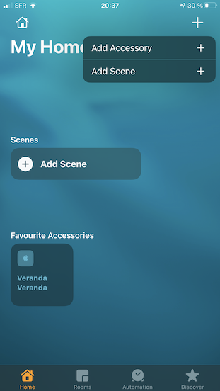
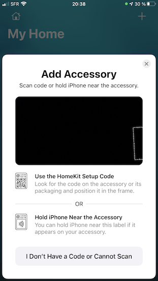
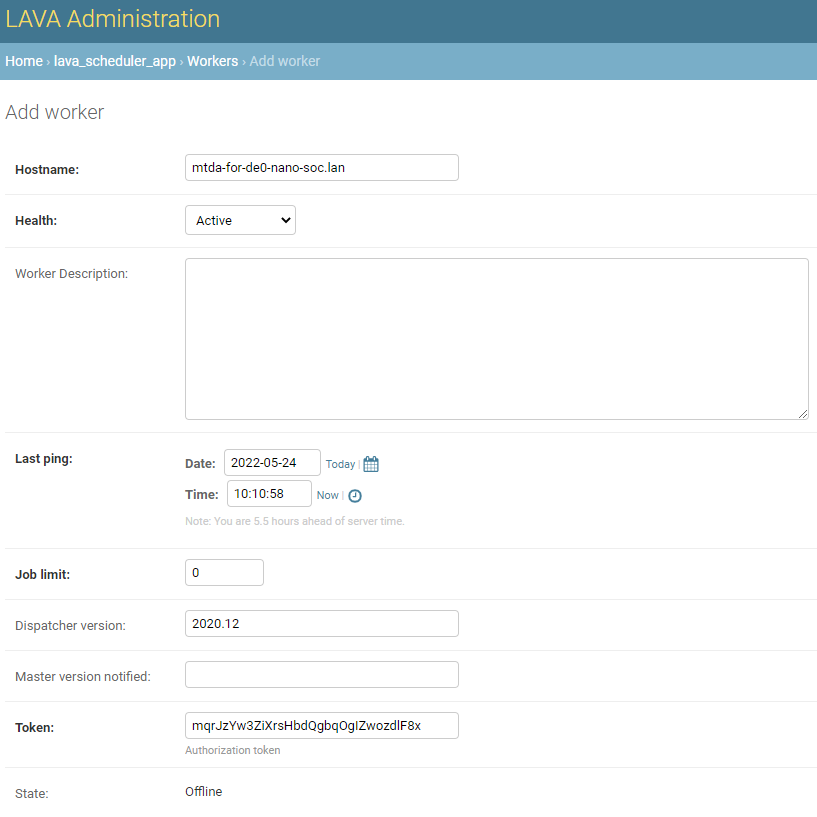

Integrate with
==============

HomeKit
-------

Introduction
~~~~~~~~~~~~

HomeKit is a smart home system to control appliances. MTDA may advertise itself
as a HomeKit compatible (but not certified) device to let users turn test devices
ON or OFF using Apple's Home application or its assistant (Siri).

Configuration
~~~~~~~~~~~~~

Add the following configuration block to your MTDA configuration file::

    [assistant]
    variant=homekit
    name=MyDevice
    port=32768

where ``name`` is the user-friendly name to be advertise on the network and
``port`` the network port to listen on.

Setup
~~~~~

Use the IOS Home application to register your MTDA device as an accessory

Proceed without a QR code by tapping on ``I Don't have a Code or Cannot Scan``

The requested code may be retrieved using the ``getenv`` command provided by
``mtda-cli``::

    $ mtda-cli -r my-mtda-device.lan getenv homekit-setup-code
    534-60-652

where ``my-mtda-device.lan`` is the name or IP address of the device running
the MTDA service. To finalize the setup of your MTDA device, tell ``Home``
where it sits and give it a name. It is recommended to display our MTDA device
as a ``Power Point``.

The ``Home`` application should now have an outlet icon for your MTDA and show its
status. Tapping on the icon will toggle power for the device attached to MTDA.

LAVA
----

Introduction
~~~~~~~~~~~~

LAVA is a continuous integration platform for deploying and testing operating systems
onto physical and virtual hardware. It needs methods to power targets, write system
images and interact with the system (usually over a serial console). These mechanics
can be provided/abstracted by MTDA. A sample deployment is shown below:

.. image:: lava_mtda_workers.png

This section provides some guidance to install LAVA and configure it to interact with
MTDA agents. Please refer to the LAVA documentation for details or for more advanced
configuration.

Install on Debian
~~~~~~~~~~~~~~~~~

A LAVA instance may be installed on Debian with ``apt``::

    $ sudo apt install -y lava

Create ``/etc/lava-server/settings.conf`` with the following settings for a
simple installation::

    "ALLOWED_HOSTS": ["infra-lava.lan"]
    "CSRF_COOKIE_SECURE": false
    "SESSION_COOKIE_SECURE": false

Replace ``infra-lava.lan`` with the network name of your Debian server. A super
user should be created::

    $ sudo lava-server manage createsuperuser --username john --email=john@foo.com

The web interface should be enabled with::

    $ sudo a2dissite 000-default
    $ sudo a2enmod proxy
    $ sudo a2enmod proxy_http
    $ sudo a2ensite lava-server.conf
    $ sudo service apache2 restart
    $ sudo service lava-server-gunicorn restart

Check whether lava-server is running::

    $ sudo systemctl status lava-server-gunicorn

Access the web interface with the following URL in the browser::

    http://infra-lava.lan

Sign in to your account with the created superuser. Login should be successful.

Attach to lava-server
~~~~~~~~~~~~~~~~~~~~~

The sample NanoPi NEO image comes with the ``lava-dispatcher`` package
preinstalled. It however needs to be configured to connect to the LAVA server
and logger installed as noted above. You may connect to the MTDA agent using
``ssh`` (default credentials are ``mtda``/``mtda``)::

    $ ssh mtda@mtda-for-de0-nano-soc.lan

Create a worker on the lava-server web interface through::
    
    Administration -> Lava Scheduler App -> Worker (Add)

Add hostname and dispatcher version details as shown below:

It should be noted that token value is automatically generated when adding the
worker. You need to copy this token key and add it to worker configuration. 

Use ``vi`` to edit ``/etc/lava-dispatcher/lava-worker``::

    $ sudo vi /etc/lava-dispatcher/lava-worker

and set the following variables to match your network::

    URL="http://infra-lava.lan"
    LOGLEVEL="DEBUG"
    HOSTNAME="--hostname mtda-for-de0-nano-soc.lan"
    TOKEN="--token mqrJzYw3ZiXrsHbdQgbqOgIZwozdlF8x"

Replace ``mtda-for-de0-nano-soc.lan`` with the network name of the worker, along
with token ``mqrJzYw3ZiXrsHbdQgbqOgIZwozdlF8x`` with the generated token.

The service should be restarted::

    $ sudo systemctl restart lava-worker

Check whether lava-worker is running::

    $ sudo systemctl status lava-worker

Verify in the lava-server web interface UI whether the created lava-worker is 
status is listed as online.

Device support
~~~~~~~~~~~~~~

A ``mtda`` device type may be added to your LAVA installation and used as a
base for devices added to your LAVA instance. Create
``/etc/lava-server/dispatcher-config/device-types/mtda.jinja2`` as follows::

    {# device_type: mtda #}
    

    
    

    
    
    
    

    

    
    actions:
      deploy:
        methods:
          flasher:
            commands: {{ mtda_deploy_cmds|default(def_mtda_deploy_cmds) }}
      boot:
        connections:
          serial:
        methods:
          minimal:
    

    
    timeouts:
      actions:
        bootloader-retry:
          minutes: 2
        bootloader-interrupt:
          minutes: 5
        bootloader-commands:
          minutes: 5
      connections:
        bootloader-retry:
          minutes: 2
        bootloader-interrupt:
          minutes: 5
        bootloader-commands:
          minutes: 5
    

The ``mtda`` device type needs to be registered as follows::

    $ sudo lava-server manage device-types add mtda

Register devices
~~~~~~~~~~~~~~~~

A Jinja file for your test device needs to be created in
``/etc/lava-server/dispatcher-config/devices/`` with the following contents::

    
    

where ``mtda-for-de0-nano-soc.lan`` is the name of the host running the MTDA agent
and being physically connected to the device to be tested. The file should be
named ``<device>.jinja2`` where ``<device>`` is the name of your device (e.g.
``de0-nano-soc1``).

Once created, the device needs to be registered::

    $ lava-server manage devices add \
          --device-type mtda \
          --worker mtda-for-de0-nano-soc.lan \
          de0-nano-soc1

It should be noted that while MTDA agent images include ``lava-dispatcher``,
you may choose to use a separate worker (``mtda-cli`` needs to be installed)
to get more adequate storage (test images are downloaded on the worker) and/or
more compute power as depicted below:

.. image:: lava_shared_worker.png

Change the ``--worker`` option to use this intermediate node instead of the
MTDA agent.

Context variables
~~~~~~~~~~~~~~~~~

LAVA jobs may override variables from device or device-type dictionaries. By
default, only white-listed variables (about a dozen options for qemu machines
and a dozen miscellaneous options) may be added to the ``context`` dictionary.
Additional keywords may be added to the schema by adding the following line
to ``/etc/lava-server/settings.conf``::

    "EXTRA_CONTEXT_VARIABLES": ["mtda_agent"]

The LAVA server will require a restart for these changes to take effect (it
will otherwise refuse to validate job definitions having MTDA options listed
under the ``context`` clause.

pytest
------

Introduction
~~~~~~~~~~~~

The pytest framework makes it easy to write tests in Python and exercise your
software stack. MTDA provides support classes to interact with your device
and verify its functions using a suite of pytest units. MTDA API tests found
in the ``tests`` folder may be used as examples.

Test Fixtures
~~~~~~~~~~~~~

Test fixtures initialize test functions and provide a fixed baseline so that
tests execute reliably and produce consistent, repeatable, results. Tests
may specify the test conditions they expect by naming the fixture they expect
as argument. In order to share fixtures between tests, a ``conftest.py`` file
may be created within your ``tests`` folder. Fixtures are regular Python
functions that are decorated with ``@pytest.fixture``.

A sample ``conftest.py`` file is provided below. It defines two simple test
fixtures: ``powered_off`` and ``powered_on``::

    import pytest

    from mtda.pytest import Target
    from mtda.pytest import Test

    @pytest.fixture()
    def powered_off():
        Test.setup()
        assert Target.off() is True

        yield "powered off"

        Test.teardown()

    @pytest.fixture()
    def powered_on():
        Test.setup()
        assert Target.on() is True

        yield "powered on"

        Test.teardown()

Statements before the ``yield`` keyword are setup statements (i.e. what needs
to be done before a test is executed) and statements that are following will
tear the test down.

The setup phase requires a connection to the (remote) MTDA service and will
be achieved with ``Test.setup()``. In addition to creating a MTDA session,
this will also make pytest receive console and monitor messages on the stdout
stream (which is captured by pytest). That console will be unmuted and muted
respectively by the ``setup`` and ``teardown`` methods to capture output
from the device only while tests are running.

Additional fixtures may be created in order to e.g. get a shell prompt,
get the device connected to the network, programmatically attach USB
devices, etc.

Writing tests
~~~~~~~~~~~~~

Test units may be created in the ``tests`` folder and their name prefixed
with ``test_`` for pytest to auto-discover your tests. The name of the unit
should denote the area being tested; e.g. ``test_network.py`` for networking
tests.

Tests are functions within the unit and also prefixed with ``test_``. Tests
should specify the test fixture they require as argument. The following
example shows how to check if a login prompt is offered after the test device
is powered on::

    from mtda.pytest import Console
    from mtda.pytest import Target

    def test_console_wait_for(powered_off):
        # Power on and wait for login prompt
	# with a timeout of 5 minutes
        assert Target.on() is True
        assert Console.wait_for("login:", timeout=5*60) is not None

This sample test uses the ``powered_off`` fixture created above to make sure
the test is started with the device off. It is then turned on with
``Target.on`` and we then expect ``login:`` to be printed on the console.

MTDA client APIs may be used to write more complex tests.
