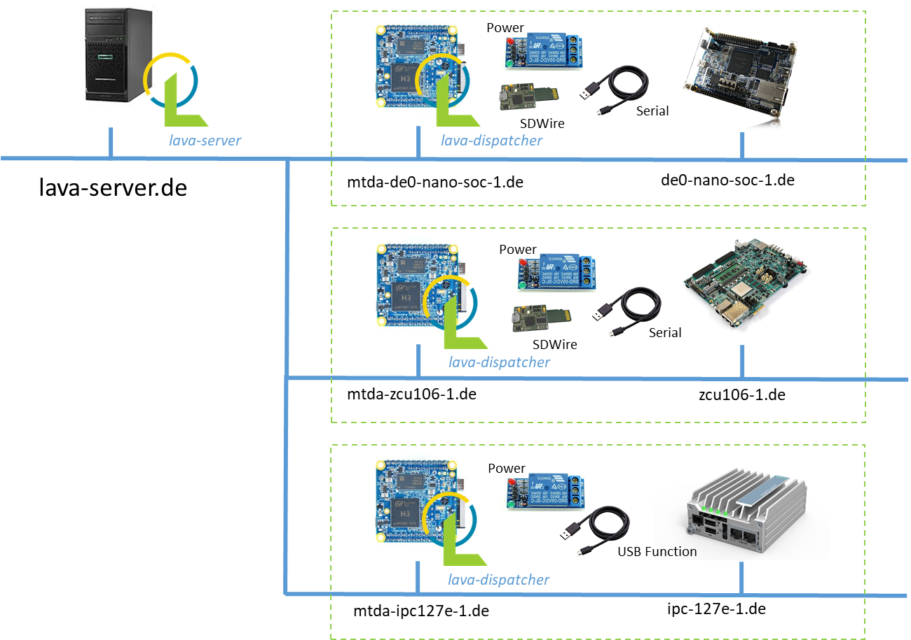
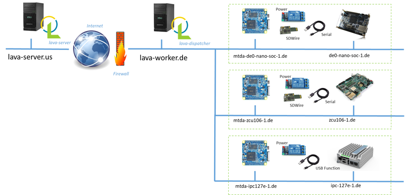

Use with LAVA
=============

Introduction
------------

LAVA is a continuous integration platform for deploying and testing operating systems
onto physical and virtual hardware. It needs methods to power targets, write system
images and interact with the system (usually over a serial console). These mechanics
can be provided/abstracted by MTDA. A sample deployment is shown below:

This section provides some guidance to install LAVA and configure it to interact with
MTDA agents. Please refer to the LAVA documentation for details or for more advanced
configuration.

Installing LAVA on Debian
-------------------------

A LAVA instance may be installed on Debian with ``apt``::

    $ sudo apt install -y lava

Create ``/etc/lava-server/settings.conf`` with the following settings for a
simple installation::

    "ALLOWED_HOSTS": ["infra-lava.lan"]
    "CSRF_COOKIE_SECURE": false
    "SESSION_COOKIE_SECURE": false

Replace ``infra-lava.lan`` with the network name of your Debian server. A super
user should be created::

    $ sudo lava-server manage createsuperuser --username john --email=john@foo.com

The web interface should be enabled with::

    $ sudo a2dissite 000-default
    $ sudo a2enmod proxy
    $ sudo a2enmod proxy_http
    $ sudo a2ensite lava-server.conf
    $ sudo service apache2 restart
    $ sudo service lava-server-gunicorn restart

Attaching your MTDA device to LAVA
----------------------------------

The sample NanoPI NEO image comes with the ``lava-dispatcher`` package
pre-installed. It however needs to be configured to connect to the LAVA master
and logger installed as noted above. You may connect to the MTDA agent using
``ssh`` (default credentials are ``mdta``/``mtda``)::

    $ ssh mtda@mtda-for-de0-nano-soc.lan

Use ``vi`` to edit ``/etc/lava-dispatcher/lava-slave``::

    $ sudo vi /etc/lava-dispatcher/lava-slave

and set the following variables to match your network::

    MASTER_URL="tcp://infra-lava.lan:5556"
    LOGGER_URL="tcp://infra-lava.lan:5555"
    HOSTNAME="--hostname mtda-for-de0-nano-soc.lan"

The service should be restarted::

    $ sudo systemctl restart lava-slave

Adding support for devices attached to MTDA
-------------------------------------------

A ``mtda`` device type may be added to your LAVA installation and used as a
base for devices added to your LAVA instance. Create
``/etc/lava-server/dispatcher-config/device-types/mtda.jinja2`` as follows::

    {# device_type: mtda #}
    

    
    

    
    
    
    

    

    
    actions:
      deploy:
        methods:
          flasher:
            commands: {{ mtda_deploy_cmds|default(def_mtda_deploy_cmds) }}
      boot:
        connections:
          serial:
        methods:
          minimal:
    

    
    timeouts:
      actions:
        bootloader-retry:
          minutes: 2
        bootloader-interrupt:
          minutes: 5
        bootloader-commands:
          minutes: 5
      connections:
        bootloader-retry:
          minutes: 2
        bootloader-interrupt:
          minutes: 5
        bootloader-commands:
          minutes: 5
    

The ``mtda`` device type needs to be registered as follows::

    $ sudo lava-server manage device-types add mtda

Adding test devices
-------------------

A Jinja file for your test device needs to be created in
``/etc/lava-server/dispatcher-config/devices/`` with the following contents::

    
    

where ``mtda-for-de0-nano-soc.lan`` is the name of the host running the MTDA agent
and being physically connected to the device to be tested. The file should be
named ``<device>.jinja2`` where ``<device>`` is the name of your device (e.g.
``de0-nano-soc1``).

Once created, the device needs to be registered::

    $ lava-server manage devices add \
          --device-type mtda \
          --worker mtda-for-de0-nano-soc.lan \
          de0-nano-soc1

It should be noted that while MTDA agent images include ``lava-dispatcher``,
you may choose to use a separate worker (``mtda-cli`` needs to be installed)
to get more adequate storage (test images are downloaded on the worker) and/or
more compute power as depicted below:

Change the ``--worker`` option to use this intermediate node instead of the
MTDA agent.

Passing context variables to device dictionaries
------------------------------------------------

LAVA jobs may override variables from device or device-type dictionaries. By
default, only white-listed variables (about a dozen options for qemu machines
and a dozen miscellaneous options) may be added to the ``context`` dictionary.
Additional keywords may be added to the schema by adding the following line
to ``/etc/lava-server/settings.conf``::

    "EXTRA_CONTEXT_VARIABLES": ["mtda_agent"]

The LAVA server will require a restart for these changes to take effect (it
will otherwise refuse to validate job definitions having MTDA options listed
under the ``context`` clause.
